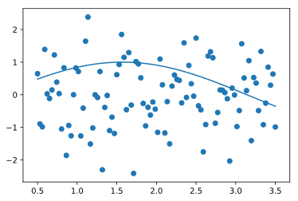
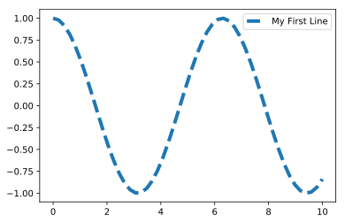
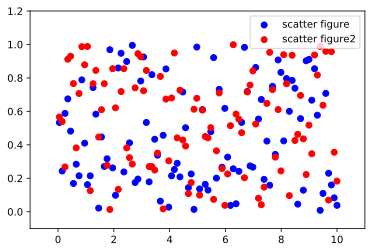
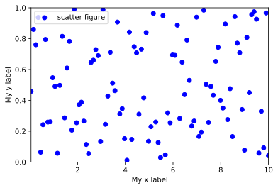
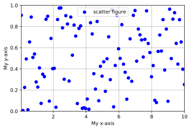
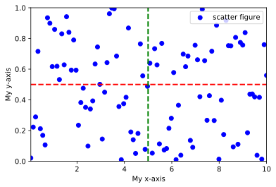

数据可视化
###############

matplotlib
********************

这里我们介绍python中进行简单数据可视化的方法，使用的工具是python中最基础的matplotlib库。

Matplotlib图表组成
++++++++++++++++++++

我们通过一个例子来看一张Matplotlib图表是如何绘制的。

画图的第一步是准备数据，数据可以手动输入，也可以通过文件进行导入，本节内容较为简单，暂时采用手动输入的形式，关于数据的导入方法，可参考pandas相关教程。

为了处理数据和绘图，我们首先导入第三方包Numpy和快速绘图模块pyplot，其中科学计算包Numpy是matplotlib库的基础，也就是说，matplotlib库是建立在Numpy库基础上的Python绘图库。

.. code-block:: python
	
	import numpy as np
	import matplotlib.pyplot as plt

现在我们就可以定义一些完成绘图所需的数据了，例如

.. code-block:: python
	
	x = np.linspace(0.5,3.5,100) # 在0.5到3.5之间均匀地取100个数
	y = np.sin(x)           # 求出每一个数对应的正弦值
	y1 = np.random.randn(100) # 在标准正态分布中随机地取100个数
		
然后开始绘图

.. code-block:: python

	plt.plot(x,y)   # 绘制(x,y)
	plt.scatter(x,y1) # 绘制(x,y1)

下面我们通过函数的形式来学习绘图，反过来，再用绘图的形式来强化对函数的记忆。

函数 ``plot()`` ——展现变量的变化趋势
====================================================

- 函数功能：展现变量的变化趋势
- 调用方法： ``plt.plot(x,y,ls='-',lw=2,label='plot figure')`` 
- 参数说明
    * ``x``: x轴上的数值
    * ``y``: y轴上的数值
    * ``ls``: linestyle,折线的线条风格
    * ``lw``: linewidth,折线的线条宽度
    * ``label``: 标记图形内容的标签文本  

.. code-block:: python

	x = np.linspace(0,10,50)  # 生成从0.05 到 10 等分的1000个数据
	y = np.cos(x) # 计算x的余弦值
	plt.plot(x,y,ls='--',lw=3,label='My First Line')  # 线性为虚线--，线宽为6，标签为'My first line'
	plt.legend()   # 显示图例，不加这一句则不显示图例

如果想了解更多 ``plot`` 参数，可以使用 ``help()`` 方法获取帮助。

.. code-block:: python

	help(plt.plot)

函数 ``scatter()`` ——寻找变量之间的关系
===================================================================

- 函数功能：散点图，寻找变量之间的关系
- 调用方法：``plt.scatter(x,y,c='b',label = 'scatter figure')``
- 参数说明
    * ``x``: x轴上的数值
    * ``y``: y轴上的数值
    * ``c``: 散点图中的标记颜色
    * ``label``: 标记图形内容的标签文本  

.. code-block:: python

	x = np.linspace(0.05,10,100) # 生成从0.05 到 10 等分的100个数据
	y = np.random.rand(100) # 生成100个正态分布的随机数
	plt.scatter(x,y,c= 'b',label='my figure') 

	y1 = np.random.rand(100) # 生成100个正态分布的随机数
	plt.scatter(x,y1,c= 'r',label='red') 
	plt.legend()

.. image:: images/python_basic/scatter函数.svg
    :align: center

设置x轴的数值显示范围函数 ``xlim`` 
=========================================================

- 函数功能：设置x轴的数值显示范围
- 调用方法： ``plt.xlim(xmin,xmax)``
- 参数说明
    * ``xmin``: $x$轴上的最小值
    * ``xmax``: $x$轴上的最大值
    * 同样的方法可以用在 ``plt.ylim()`` 上

.. code-block:: python

	x = np.linspace(0.05,10,100)  # 生成从0.05 到 10 等分的100个数据
	y = np.random.rand(100)# 生成100个正态分布的随机数
	y1 = np.random.rand(100) # 生成100个正态分布的随机数

	plt.scatter(x,y,c= 'b',label='scatter figure')  # 绘制第一组数据
	plt.scatter(x,y1,c= 'r',label='scatter figure2') # 绘制第二组数据

	plt.legend() # 增加图例
	plt.xlim(-1,11) # 设置x轴显示范围
	plt.ylim(-0.1,1.2) # 设置y轴显示范围

.. warning::

	注意：除非特殊情况，不推荐大家自定坐标轴显示范围。因为这可能会导致后续数据改变以后，图像变得很奇怪。

函数 ``xlabel()``  ——设置x轴的标签文本
=========================================================

- 函数功能：设置x轴的标签文本
- 调用方法：``plt.xlabel(string)``
- 参数说明
    * ``string``: 标签文本内容
    * 同样的方法可以用在 ``plt.ylabel()`` 上

.. code-block:: python

	x = np.linspace(0.05, 10, 100)  # 生成从0.05 到 10 等分的100个数据
	y = np.random.rand(100)   # 生成100个正态分布的随机数
	plt.scatter(x, y, c='b', label='scatter figure')  # 绘图
	plt.legend()  # 增加图例
	plt.xlim(0.05, 10)  # 设置x轴显示范围
	plt.ylim(0, 1)  # 设置y轴显示范围
	plt.xlabel('Time') # 设置x轴标签
	plt.ylabel(r'$v_1$') # 设置y轴标签

函数 ``grid()`` ——绘制刻度线的网格线
=========================================================

- 函数功能：绘制刻度线的网格线
- 调用方法：``plt.grid(linestyle = ':', color = 'r')``
- 参数说明
    * ``linestyle``: 网格的线条风格
    * ``color``: 网格的线条颜色

.. code-block:: python

	x = np.linspace(0.05,10,100)
	y = np.random.rand(100)
	plt.scatter(x,y,c= 'b',label='scatter figure')
	plt.legend()
	plt.xlim(0.05,10)
	plt.ylim(0,1)
	plt.xlabel('My x-axis')
	plt.ylabel('My y-axis')
	plt.grid(linestyle = '-', color = 'black',alpha = 0.3)  # 增加刻度线

当然，如果需要的话，更多的参数设置方法，你也可以通过 ``help()`` 去查看

.. code-block:: python

	help(plt.grid)

函数 ``axhline()`` ——绘制平行于x轴的水平参考线
=========================================================

- 函数功能：绘制平行于x轴的水平参考线
- 调用方法：``plt.axhline(y=0.0,c='r',ls='--',lw=2)``
- 参数说明
    * ``y``: 水平参考线的出发点
    * ``c``: 参考线的线条颜色
    * ``ls``: 参考线的线条风格
    * ``lw``: 参考线的线条宽度
    * 上面的函数功能一样可以用到\ ``axvline``\ 上

.. code-block:: python

	x = np.linspace(0.05,10,100)
	y = np.random.rand(100)
	plt.scatter(x,y,c= 'b',label='scatter figure')
	plt.legend()
	plt.xlim(0.05,10)
	plt.ylim(0,1)
	plt.xlabel('My x-axis')
	plt.ylabel('My y-axis')
	plt.axhline(y=0.5,c='r',ls='--',lw=2)  # 增加水平线
	plt.axvline(x=5,c='g',ls='--',lw=2)    # 增加垂直线

